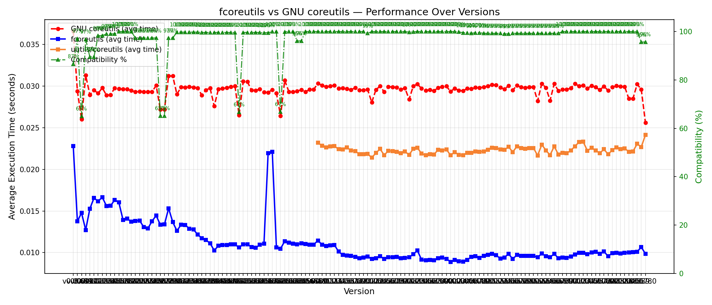

# fcoreutils vs GNU coreutils — Independent Benchmark

> Independent quality assurance for [fcoreutils](https://github.com/AiBrush/coreutils-rs), a Rust rewrite of GNU coreutils.

## Performance Over Versions



## Latest Results (v0.0.47)

### Summary
- **Tools tested:** 10 (wc, cut, sha256sum, md5sum, b2sum, base64, sort, tr, uniq, tac)
- **Compatibility:** 823/826 tests passed (99.6%)
- **Fastest speedup:** wc at 31.2x faster than GNU

### Performance Highlights

| Tool | Speedup (vs GNU) |
|------|----------------:|
| wc | **31.2x** |
| cut | **7.1x** |
| sha256sum | **1.1x** |
| md5sum | **1.3x** |
| b2sum | **1.3x** |
| base64 | **3.0x** |
| sort | **9.5x** |
| tr | **2.7x** |
| uniq | **12.4x** |
| tac | **2.5x** |

### Known Issues
- 3 compatibility test failures across 2 platforms

## Per-Version Details

Detailed results for each version (benchmarks, compatibility, failures) are in the [`results/`](results/) directory.

## How It Works
- Downloads pre-built fcoreutils binaries from GitHub releases
- Runs 826+ compatibility tests comparing output byte-for-byte against GNU coreutils
- Benchmarks using `hyperfine` with warmup runs and timed runs
- Tests run across multiple platforms via GitHub Actions

## Running Locally
```bash
# Run benchmarks for the latest version
./scripts/install_from_github.sh
./tests/benchmarks/run_all.sh

# Run compatibility tests
./tests/compatibility/run_all.sh

# Generate the plot
pip install matplotlib
python3 scripts/plot_speedup.py
```
