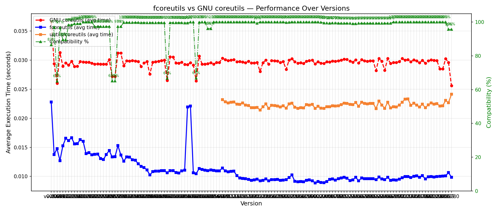

# fcoreutils vs GNU coreutils — Independent Benchmark

> Independent quality assurance for [fcoreutils](https://github.com/AiBrush/fcoreutils), a Rust rewrite of GNU coreutils.

## Performance Over Versions



## Latest Results (v0.13.0)

### Summary
- **Tools tracked:** 107 total
- **Compatibility:** 2203/2224 tests passed (99.1%)
- **Fastest speedup:** wc at 31.3x faster than GNU

### Full Tools Comparison

> Sizes from release binaries. Compat = pass rate on Linux x86_64. Speedup = peak across all benchmark scenarios.
> `-` = no data collected yet for this tool/metric.

| Tool | fcoreutils size | GNU size | Compat f\* vs GNU | Speedup f\* vs GNU |
|------|----------------:|----------:|------------------:|-------------------:|
| arch | 424.9 KB | 34.5 KB | ✅ 100% | **0.8x** |
| b2sum | 633.9 KB | 54.5 KB | ✅ 100% | **1.3x** |
| base32 | 445.3 KB | 38.5 KB | ✅ 100% | **1.5x** |
| base64 | 558.6 KB | 38.5 KB | ✅ 100% | **5.6x** |
| basename | 429.7 KB | 34.5 KB | ✅ 100% | **0.8x** |
| basenc | 458.9 KB | 46.5 KB | ✅ 100% | **1.1x** |
| cat | 459.0 KB | 38.5 KB | ✅ 100% | **2.4x** |
| chcon | 458.9 KB | 58.5 KB | ❌ 0% | - |
| chgrp | 523.9 KB | 58.5 KB | ✅ 100% | **1.0x** |
| chmod | 525.5 KB | 54.5 KB | ✅ 100% | **0.9x** |
| chown | 528.4 KB | 58.5 KB | ✅ 100% | **0.9x** |
| chroot | 464.7 KB | 38.5 KB | ❌ 0% | - |
| cksum | 450.5 KB | 102.5 KB | ✅ 100% | **1.2x** |
| comm | 453.7 KB | 38.5 KB | ✅ 100% | **3.4x** |
| cp | 562.3 KB | 138.5 KB | ✅ 100% | **1.0x** |
| csplit | 1.8 MB | 50.5 KB | - | **17.1x** |
| cut | 635.1 KB | 38.5 KB | ✅ 100% | **5.4x** |
| date | 505.2 KB | 106.5 KB | ✅ 100% | - |
| dd | 500.0 KB | 70.5 KB | ✅ 100% | **1.0x** |
| df | 540.2 KB | 87.1 KB | ⚠️ 53% | - |
| dir | 585.5 KB | 139.0 KB | ❌ 0% | - |
| dircolors | 450.1 KB | 46.5 KB | ✅ 100% | - |
| dirname | 426.5 KB | 34.4 KB | ✅ 100% | **0.8x** |
| du | 510.9 KB | 98.5 KB | ✅ 100% | - |
| echo | 426.4 KB | 34.4 KB | ✅ 100% | **0.8x** |
| env | 467.4 KB | 46.9 KB | ✅ 100% | **0.9x** |
| expand | 453.5 KB | 34.5 KB | ✅ 100% | **9.6x** |
| expr | 1.8 MB | 42.4 KB | ✅ 100% | **0.8x** |
| factor | 453.0 KB | 62.5 KB | ✅ 100% | **0.9x** |
| false | 297.0 KB | 26.3 KB | ✅ 100% | - |
| fmt | 457.9 KB | 38.5 KB | ✅ 100% | - |
| fold | 448.2 KB | 34.5 KB | ✅ 100% | **4.6x** |
| groups | 428.5 KB | 34.5 KB | ✅ 100% | **0.8x** |
| head | 451.9 KB | 42.5 KB | ✅ 100% | **1.7x** |
| hostid | 424.7 KB | 34.5 KB | ✅ 100% | **0.8x** |
| id | 433.1 KB | 38.5 KB | ✅ 100% | **1.0x** |
| install | 513.4 KB | 142.5 KB | ✅ 100% | **1.0x** |
| join | 467.3 KB | 50.5 KB | ✅ 100% | **1.0x** |
| kill | 453.2 KB | 22.4 KB | ❌ 0% | - |
| link | 430.5 KB | 34.5 KB | ✅ 100% | **0.9x** |
| ln | 451.7 KB | 54.5 KB | ✅ 100% | **0.9x** |
| logname | 424.7 KB | 34.5 KB | ✅ 100% | **0.8x** |
| ls | 586.9 KB | 139.0 KB | ✅ 100% | - |
| md5sum | 626.8 KB | 38.4 KB | ✅ 100% | **1.0x** |
| mkdir | 442.5 KB | 74.5 KB | ✅ 100% | **1.0x** |
| mkfifo | 432.3 KB | 42.5 KB | ✅ 100% | **1.0x** |
| mknod | 434.4 KB | 42.5 KB | ✅ 100% | **1.0x** |
| mktemp | 443.9 KB | 34.5 KB | ✅ 100% | - |
| mv | 474.8 KB | 134.5 KB | - | **1.0x** |
| nice | 457.5 KB | 34.5 KB | ✅ 100% | **0.9x** |
| nl | 1.8 MB | 38.6 KB | ✅ 100% | **4.5x** |
| nohup | 455.6 KB | 34.4 KB | ✅ 100% | **0.9x** |
| nproc | 444.0 KB | 34.5 KB | ✅ 100% | **0.8x** |
| numfmt | 517.0 KB | 58.5 KB | ✅ 100% | - |
| od | 523.2 KB | 70.5 KB | ✅ 100% | - |
| paste | 450.4 KB | 38.4 KB | ✅ 100% | **2.5x** |
| pathchk | 438.7 KB | 34.5 KB | ✅ 100% | **0.8x** |
| pinky | 768.6 KB | 38.4 KB | ✅ 100% | - |
| pr | 502.2 KB | 70.6 KB | ✅ 100% | - |
| printenv | 428.4 KB | 34.4 KB | ❌ 0% | - |
| printf | 493.3 KB | 54.4 KB | ✅ 100% | - |
| ptx | 525.9 KB | 54.5 KB | ✅ 100% | - |
| pwd | 429.2 KB | 34.5 KB | ✅ 100% | - |
| readlink | 439.2 KB | 42.4 KB | ✅ 100% | **0.8x** |
| realpath | 443.5 KB | 42.4 KB | ✅ 100% | **0.8x** |
| rev | 439.3 KB | 14.4 KB | ✅ 100% | **22.0x** |
| rm | 522.7 KB | 58.5 KB | ✅ 100% | **0.9x** |
| rmdir | 431.0 KB | 46.4 KB | ✅ 100% | **0.9x** |
| runcon | 463.9 KB | 34.5 KB | ❌ 0% | - |
| seq | 485.9 KB | 50.5 KB | ✅ 100% | **15.6x** |
| sha1sum | 616.9 KB | 38.4 KB | ✅ 100% | **0.9x** |
| sha224sum | 617.0 KB | 38.4 KB | ✅ 100% | **0.9x** |
| sha256sum | 617.8 KB | 38.4 KB | ✅ 100% | **1.0x** |
| sha384sum | 616.9 KB | 38.4 KB | ✅ 100% | **0.9x** |
| sha512sum | 617.0 KB | 38.4 KB | ✅ 100% | **0.9x** |
| shred | 456.5 KB | 54.5 KB | ✅ 100% | **2.1x** |
| shuf | 470.0 KB | 46.5 KB | ✅ 100% | - |
| sleep | 444.4 KB | 34.5 KB | ✅ 100% | **0.9x** |
| sort | 1.0 MB | 102.8 KB | ✅ 100% | **12.2x** |
| split | 523.7 KB | 54.9 KB | ✅ 100% | **1.0x** |
| stat | 465.5 KB | 86.5 KB | ⚠️ 97% | - |
| stdbuf | 484.4 KB | 50.5 KB | ✅ 100% | - |
| stty | 454.7 KB | 78.5 KB | ⚠️ 57% | - |
| sum | 439.7 KB | 34.4 KB | ✅ 100% | **1.4x** |
| sync | 430.2 KB | 34.4 KB | ⚠️ 83% | **0.8x** |
| tac | 1.9 MB | 38.4 KB | ✅ 100% | **3.1x** |
| tail | 477.9 KB | 62.5 KB | ✅ 100% | **1.4x** |
| tee | 443.4 KB | 38.5 KB | ✅ 100% | - |
| test | 440.5 KB | 46.4 KB | ✅ 100% | - |
| timeout | 486.9 KB | 38.9 KB | ✅ 100% | - |
| touch | 457.8 KB | 94.5 KB | ✅ 100% | **0.9x** |
| tr | 696.2 KB | 46.5 KB | ✅ 100% | **6.7x** |
| true | 296.6 KB | 26.3 KB | ✅ 100% | - |
| truncate | 441.2 KB | 38.5 KB | ✅ 100% | **0.9x** |
| tsort | 464.7 KB | 46.5 KB | ✅ 100% | - |
| tty | 425.8 KB | 34.5 KB | ✅ 100% | **0.8x** |
| uname | 428.6 KB | 34.5 KB | ✅ 100% | **0.8x** |
| unexpand | 453.3 KB | 38.5 KB | ✅ 100% | **4.3x** |
| uniq | 907.0 KB | 38.5 KB | ✅ 100% | **10.1x** |
| unlink | 429.4 KB | 34.5 KB | ✅ 100% | **0.9x** |
| uptime | 501.2 KB | 14.4 KB | ✅ 100% | - |
| users | 461.2 KB | 34.5 KB | ✅ 100% | - |
| vdir | 585.5 KB | 139.0 KB | ❌ 0% | - |
| wc | 906.6 KB | 54.5 KB | ⚠️ 99% | **31.3x** |
| who | 782.6 KB | 58.5 KB | ✅ 100% | - |
| whoami | 425.0 KB | 34.5 KB | ✅ 100% | **0.8x** |
| yes | 1.8 KB | 34.4 KB | ✅ 100% | **4.1x** |

### Known Issues
- 55 compatibility test failures across 3 platform(s)

## Per-Version Details

Detailed results for each version (benchmarks, compatibility, failures) are in the [`results/`](results/) directory.

## Sources
- [fcoreutils](https://github.com/AiBrush/fcoreutils) — installed from GitHub Releases
- GNU coreutils — system-installed baseline

## How It Works
- Downloads pre-built fcoreutils binaries from GitHub releases
- Runs 2224+ compatibility tests comparing output byte-for-byte against GNU coreutils
- Benchmarks using `hyperfine` with warmup runs and timed runs
- Measures binary sizes of f\* and GNU for each tool
- Tests run across multiple platforms via GitHub Actions

## Running Locally
```bash
# Install and test
./scripts/install_from_github.sh
./tests/compatibility/run_all.sh
./tests/benchmarks/run_all.sh

# Generate chart
pip install matplotlib
python3 scripts/plot_speedup.py
```
