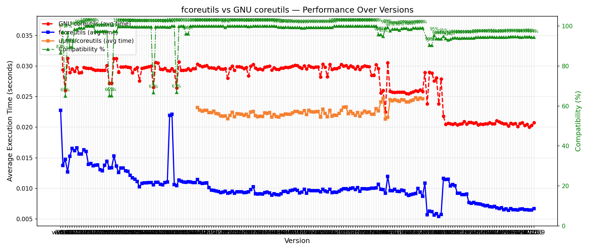

# fcoreutils vs GNU coreutils — Independent Benchmark

> Independent quality assurance for [fcoreutils](https://github.com/AiBrush/fcoreutils), a Rust rewrite of GNU coreutils.

## Performance Over Versions



## Latest Results (v0.19.3)

### Summary
- **Tools tracked:** 107 total (107 with binaries)
- **Compatibility:** 3806/3911 tests passed (97.3%) across 107 tools
- **Benchmarked:** 101 tools with performance data
- **Fastest speedup:** unexpand at 37.8x faster than GNU

### Assembly (x86-64 nasm) Summary
- **Assembly tools:** 29 tools (static ELF binaries, no libc)
- **GNU compat tests:** 831 passed, 26 failed
- **Security tests:** 3101/3139 passed (98.8%)
- **Tools:** arch, base64, cat, cut, echo, expand, false, fold, head, hostid, logname, md5sum, nl, od, pwd, rev, seq, sleep, sort, sync, tac, tail, tr, true, tty, unexpand, uniq, wc, whoami, yes

### Full Tools Comparison

> Sizes from release binaries. Compat = pass rate on Linux x86_64. Speedup = peak across all benchmark scenarios.
>
> Legend: `-` = no data collected | `N/A` = not applicable | `⏭️ 0 tests` = test ran but produced 0 results
> ASM columns only shown for tools with x86-64 assembly implementations.

| Tool | fcoreutils size | GNU size | Compat f\* vs GNU | Speedup f\* vs GNU | ASM size | ASM vs GNU | ASM Compat | ASM Security |
|------|----------------:|---------:|------------------:|-------------------:|---------:|-----------:|-----------:|-------------:|
| arch | 425.7 KB | 34.5 KB | ✅ 17/17 | 0.9x | 13.3 KB | - | ⚠️ 75% | ✅ 97/97 |
| b2sum | 633.8 KB | 54.5 KB | ✅ 25/25 | **1.2x** | - | - | - | - |
| base32 | 447.1 KB | 38.5 KB | ✅ 29/29 | **1.8x** | - | - | - | - |
| base64 | 551.7 KB | 38.5 KB | ✅ 33/33 | **6.7x** | 5.7 KB | **1.7x** | ✅ 17/17 | ✅ 123/123 |
| basename | 430.3 KB | 34.5 KB | ✅ 26/26 | 0.9x | - | - | - | - |
| basenc | 467.7 KB | 46.5 KB | ⚠️ 99% (95/96) | **2.6x** | - | - | - | - |
| cat | 476.0 KB | 38.5 KB | ✅ 49/49 | **1.6x** | 17.7 KB | **4.0x** | ✅ 65/65 | ⚠️ 98% |
| chcon | 459.3 KB | 58.5 KB | ⚠️ 62% (15/24) | N/A | - | - | - | - |
| chgrp | 524.4 KB | 58.5 KB | ⚠️ 89% (17/19) | **1.0x** | - | - | - | - |
| chmod | 529.8 KB | 54.5 KB | ⚠️ 99% (78/79) | - | - | - | - | - |
| chown | 528.7 KB | 58.5 KB | ⚠️ 85% (17/20) | **1.0x** | - | - | - | - |
| chroot | 465.6 KB | 38.5 KB | ⚠️ 47% (18/38) | N/A | - | - | - | - |
| cksum | 713.7 KB | 102.5 KB | ✅ 48/48 | **1.3x** | - | - | - | - |
| comm | 456.2 KB | 38.5 KB | ✅ 30/30 | **4.2x** | - | - | - | - |
| cp | 571.4 KB | 138.5 KB | ✅ 69/69 | **1.2x** | - | - | - | - |
| csplit | 1.1 MB | 50.5 KB | ✅ 2/2 | - | - | - | - | - |
| cut | 625.4 KB | 38.5 KB | ⚠️ 97% (96/99) | **6.4x** | 9.3 KB | **4.9x** | ✅ 24/24 | ✅ 102/102 |
| date | 509.1 KB | 106.5 KB | ✅ 46/46 | 0.9x | - | - | - | - |
| dd | 503.9 KB | 70.5 KB | ✅ 29/29 | **1.1x** | - | - | - | - |
| df | 542.5 KB | 87.1 KB | ✅ 25/25 | **1.2x** | - | - | - | - |
| dir | 614.7 KB | 139.0 KB | ✅ 45/45 | **1.0x** | - | - | - | - |
| dircolors | 450.0 KB | 46.5 KB | ✅ 14/14 | 0.9x | - | - | - | - |
| dirname | 426.9 KB | 34.4 KB | ✅ 23/23 | 0.9x | - | - | - | - |
| du | 512.9 KB | 98.5 KB | ✅ 51/51 | 0.9x | - | - | - | - |
| echo | 427.5 KB | 34.4 KB | ✅ 53/53 | 0.8x | 9.6 KB | 0.2x | ✅ 57/57 | ⚠️ 99% |
| env | 476.2 KB | 46.9 KB | ⚠️ 96% (49/51) | **1.1x** | - | - | - | - |
| expand | 533.1 KB | 34.5 KB | ✅ 35/35 | **10.6x** | 32.5 KB | **4.3x** | ✅ 60/60 | ⚠️ 99% |
| expr | 1.1 MB | 42.4 KB | ✅ 43/43 | **1.0x** | - | - | - | - |
| factor | 473.1 KB | 62.5 KB | ⚠️ 93% (55/59) | **1.6x** | - | - | - | - |
| false | 297.3 KB | 26.3 KB | ✅ 6/6 | 0.7x | 5.6 KB | - | ✅ 20/20 | ⚠️ 96% |
| fmt | 465.6 KB | 38.5 KB | ✅ 22/22 | **1.3x** | - | - | - | - |
| fold | 543.1 KB | 34.5 KB | ⚠️ 98% (57/58) | **8.8x** | 9.8 KB | **7.0x** | ✅ 58/58 | ✅ 116/116 |
| groups | 429.0 KB | 34.5 KB | ✅ 28/28 | 0.9x | - | - | - | - |
| head | 457.5 KB | 42.5 KB | ⚠️ 95% (60/63) | **2.0x** | 7.2 KB | **2.9x** | ✅ 19/19 | ⚠️ 99% |
| hostid | 425.2 KB | 34.5 KB | ✅ 6/6 | 0.9x | 14.9 KB | - | ⚠️ 67% | ⚠️ 99% |
| id | 436.2 KB | 38.5 KB | ✅ 27/27 | **1.1x** | - | - | - | - |
| install | 520.7 KB | 142.5 KB | ⚠️ 84% (27/32) | 0.9x | - | - | - | - |
| join | 471.5 KB | 50.5 KB | ✅ 37/37 | **1.2x** | - | - | - | - |
| kill | 452.5 KB | 22.4 KB | ✅ 20/20 | 0.8x | - | - | - | - |
| link | 431.1 KB | 34.5 KB | ✅ 32/32 | 0.9x | - | - | - | - |
| ln | 457.2 KB | 54.5 KB | ✅ 33/33 | **1.0x** | - | - | - | - |
| logname | 425.2 KB | 34.5 KB | ✅ 13/13 | 0.9x | 15.1 KB | - | ⚠️ 56% | ⚠️ 97% |
| ls | 618.0 KB | 139.0 KB | ✅ 65/65 | **1.2x** | - | - | - | - |
| md5sum | 682.9 KB | 38.4 KB | ✅ 30/30 | **1.2x** | 9.6 KB | 0.7x | ✅ 16/16 | ✅ 133/133 |
| mkdir | 445.9 KB | 74.5 KB | ⚠️ 84% (37/44) | **1.1x** | - | - | - | - |
| mkfifo | 432.9 KB | 42.5 KB | ✅ 11/11 | **1.0x** | - | - | - | - |
| mknod | 437.7 KB | 42.5 KB | ✅ 12/12 | **1.1x** | - | - | - | - |
| mktemp | 447.0 KB | 34.5 KB | ⚠️ 88% (15/17) | 0.9x | - | - | - | - |
| mv | 477.3 KB | 134.5 KB | ✅ 3/3 | **1.0x** | - | - | - | - |
| nice | 457.2 KB | 34.5 KB | ⚠️ 94% (32/34) | 0.9x | - | - | - | - |
| nl | 1.1 MB | 38.6 KB | ⚠️ 98% (61/62) | **10.6x** | 41.7 KB | **8.7x** | ✅ 69/69 | ⚠️ 98% |
| nohup | 456.6 KB | 34.4 KB | ✅ 11/11 | **1.0x** | - | - | - | - |
| nproc | 443.1 KB | 34.5 KB | ⚠️ 94% (29/31) | **1.0x** | - | - | - | - |
| numfmt | 528.2 KB | 58.5 KB | ⚠️ 97% (32/33) | **2.1x** | - | - | - | - |
| od | 536.3 KB | 70.5 KB | ✅ 50/50 | **10.6x** | 41.2 KB | **9.6x** | ✅ 58/58 | ⚠️ 99% |
| paste | 455.5 KB | 38.4 KB | ✅ 32/32 | **3.4x** | - | - | - | - |
| pathchk | 438.8 KB | 34.5 KB | ✅ 22/22 | 0.9x | - | - | - | - |
| pinky | 483.0 KB | 38.4 KB | ✅ 32/32 | 0.8x | - | - | - | - |
| pr | 516.8 KB | 70.6 KB | ⚠️ 95% (18/19) | **8.8x** | - | - | - | - |
| printenv | 429.4 KB | 34.4 KB | ✅ 9/9 | 0.9x | - | - | - | - |
| printf | 495.5 KB | 54.4 KB | ✅ 74/74 | 0.8x | - | - | - | - |
| ptx | 534.3 KB | 54.5 KB | ✅ 15/15 | **2.4x** | - | - | - | - |
| pwd | 430.4 KB | 34.5 KB | ⚠️ 94% (16/17) | **1.0x** | 14.4 KB | - | ✅ 14/14 | ⚠️ 98% |
| readlink | 443.5 KB | 42.4 KB | ✅ 60/60 | 0.9x | - | - | - | - |
| realpath | 445.3 KB | 42.4 KB | ✅ 43/43 | 0.9x | - | - | - | - |
| rev | 439.9 KB | 14.4 KB | ✅ 32/32 | **23.3x** | 2.6 KB | **9.8x** | ✅ 15/15 | ✅ 109/109 |
| rm | 532.0 KB | 58.5 KB | ✅ 23/23 | **1.0x** | - | - | - | - |
| rmdir | 431.8 KB | 46.4 KB | ✅ 21/21 | 0.9x | - | - | - | - |
| runcon | 465.0 KB | 34.5 KB | ⚠️ 40% (2/5) | N/A | - | - | - | - |
| seq | 546.1 KB | 50.5 KB | ✅ 62/62 | **10.4x** | 39.6 KB | **20.3x** | ⚠️ 96% | ⚠️ 99% |
| sha1sum | 687.2 KB | 38.4 KB | ✅ 43/43 | **1.1x** | - | - | - | - |
| sha224sum | 679.9 KB | 38.4 KB | ✅ 39/39 | **1.3x** | - | - | - | - |
| sha256sum | 682.4 KB | 38.4 KB | ✅ 34/34 | **1.1x** | - | - | - | - |
| sha384sum | 685.2 KB | 38.4 KB | ✅ 39/39 | **1.0x** | - | - | - | - |
| sha512sum | 685.1 KB | 38.4 KB | ✅ 39/39 | 0.9x | - | - | - | - |
| shred | 457.4 KB | 54.5 KB | ✅ 27/27 | **2.3x** | - | - | - | - |
| shuf | 516.7 KB | 46.5 KB | ⚠️ 98% (52/53) | **5.1x** | - | - | - | - |
| sleep | 445.1 KB | 34.5 KB | ✅ 15/15 | 0.9x | 14.7 KB | - | ⚠️ 88% | ⚠️ 98% |
| sort | 1.1 MB | 102.8 KB | ✅ 111/111 | **12.2x** | 43.1 KB | **1.3x** | ⚠️ 85% | ⚠️ 98% |
| split | 616.0 KB | 54.9 KB | ✅ 72/72 | **1.3x** | - | - | - | - |
| stat | 464.2 KB | 86.5 KB | ✅ 38/38 | **1.1x** | - | - | - | - |
| stdbuf | 487.0 KB | 50.5 KB | ✅ 13/13 | **1.1x** | - | - | - | - |
| stty | 455.2 KB | 78.5 KB | ⚠️ 60% (25/42) | N/A | - | - | - | - |
| sum | 442.2 KB | 34.4 KB | ✅ 23/23 | **1.2x** | - | - | - | - |
| sync | 431.2 KB | 34.4 KB | ⚠️ 90% (9/10) | 0.9x | 16.1 KB | - | ✅ 16/16 | ⚠️ 98% |
| tac | 1.1 MB | 38.4 KB | ✅ 59/59 | **2.7x** | 4.6 KB | **2.1x** | ✅ 13/13 | ✅ 105/105 |
| tail | 488.3 KB | 62.5 KB | ✅ 80/80 | **1.9x** | 7.5 KB | **3.0x** | ✅ 18/18 | ✅ 111/111 |
| tee | 436.7 KB | 38.5 KB | ✅ 27/27 | **1.2x** | - | - | - | - |
| test | 440.6 KB | 46.4 KB | ✅ 116/116 | 0.9x | - | - | - | - |
| timeout | 487.4 KB | 38.9 KB | ✅ 36/36 | **1.0x** | - | - | - | - |
| touch | 461.0 KB | 94.5 KB | ⚠️ 94% (45/48) | 0.9x | - | - | - | - |
| tr | 678.0 KB | 46.5 KB | ✅ 59/59 | **7.0x** | 9.8 KB | **2.0x** | ✅ 20/20 | ✅ 102/102 |
| true | 296.9 KB | 26.3 KB | ✅ 7/7 | 0.8x | 10.8 KB | - | ✅ 9/9 | ⚠️ 97% |
| truncate | 442.5 KB | 38.5 KB | ⚠️ 94% (46/49) | **1.0x** | - | - | - | - |
| tsort | 460.9 KB | 46.5 KB | ✅ 19/19 | **10.3x** | - | - | - | - |
| tty | 425.4 KB | 34.5 KB | ✅ 10/10 | 0.9x | 13.2 KB | - | ⚠️ 75% | ⚠️ 99% |
| uname | 429.4 KB | 34.5 KB | ✅ 14/14 | 0.9x | - | - | - | - |
| unexpand | 471.7 KB | 38.5 KB | ⚠️ 96% (26/27) | **37.8x** | 24.4 KB | **4.5x** | ✅ 57/57 | ⚠️ 97% |
| uniq | 621.7 KB | 38.5 KB | ⚠️ 99% (85/86) | **11.5x** | 41.9 KB | **9.6x** | ✅ 72/72 | ⚠️ 97% |
| unlink | 430.0 KB | 34.5 KB | ✅ 30/30 | **1.0x** | - | - | - | - |
| uptime | 501.9 KB | 14.4 KB | ✅ 16/16 | **1.5x** | - | - | - | - |
| users | 462.4 KB | 34.5 KB | ✅ 6/6 | 0.9x | - | - | - | - |
| vdir | 614.7 KB | 139.0 KB | ✅ 41/41 | **1.1x** | - | - | - | - |
| wc | 629.2 KB | 54.5 KB | ✅ 77/77 | **16.0x** | - | - | - | - |
| who | 492.9 KB | 58.5 KB | ✅ 38/38 | 0.9x | - | - | - | - |
| whoami | 423.9 KB | 34.5 KB | ✅ 16/16 | 0.9x | 13.8 KB | - | ⚠️ 50% | ⚠️ 99% |
| yes | 433.5 KB | 34.4 KB | ⚠️ 86% (25/29) | **1.6x** | 1.8 KB | **1.0x** | - | - |

### Known Issues
- 246 compatibility test failures across 3 platform(s)

## Per-Version Details

Detailed results for each version (benchmarks, compatibility, failures) are in the [`results/`](results/) directory.

## Sources
- [fcoreutils](https://github.com/AiBrush/fcoreutils) — installed from GitHub Releases
- GNU coreutils — system-installed baseline

## How It Works
- Downloads pre-built fcoreutils binaries from GitHub releases
- Runs 3911+ compatibility tests comparing output byte-for-byte against GNU coreutils
- Benchmarks using `hyperfine` with warmup runs and timed runs
- Measures binary sizes of f\* and GNU for each tool
- Builds and tests x86-64 assembly implementations (nasm) for 30 tools
- Tests run across multiple platforms via GitHub Actions

## Running Locally
```bash
# Install and test (Rust)
./scripts/install_from_github.sh
./tests/compatibility/run_all.sh
./tests/benchmarks/run_all.sh

# Install and test (Assembly — Linux x86-64 only)
./scripts/install_assembly.sh
./tests/assembly/run_all.sh --repo-dir /path/to/fcoreutils --asm-dir ~/.local/bin/asm
./tests/assembly/bench_all.sh

# Generate chart
pip install matplotlib
python3 scripts/plot_speedup.py
```

## Platform Functional Tests (v0.19.3)

| Platform | Passed | Failed | Skipped | Status |
|----------|--------|--------|---------|--------|
| Linux x86_64 | 3806 | 5 | 100 | ⚠️ |
| Linux ARM64 | 656 | 118 | 30 | ⚠️ |
| macOS ARM64 | 651 | 123 | 30 | ⚠️ |
| Windows x86_64 | 0 | 0 | 0 | ⏭️ no tests ran |
| Windows ARM64 | — | — | — | 🔍 x86_64 binary under ARM64 emulation — full test suite skipped to avoid SIMD crashes |
